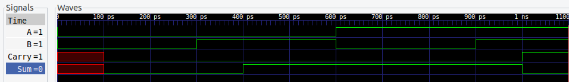

# Digital Logic Simulator

⚠️ **Work in Progress** - Event-driven digital logic simulator in C++.

## Build & Run

```bash
mkdir build && cd build
cmake ..
make
./test_integration
```

## Example: Half-Adder Circuit

```cpp
#include "simulator.h"
#include "signal.h"
#include "gate.h"

int main() {
    Simulator sim;
    sim.enable_trace();  // Enable waveform output
    
    // Create signals
    Signal* a = sim.create_signal("A", 0);
    Signal* b = sim.create_signal("B", 0);
    Signal* sum = sim.create_signal("Sum", 2);
    Signal* carry = sim.create_signal("Carry", 2);
    
    // Build half-adder: Sum = A XOR B, Carry = A AND B
    XORGate* xor_gate = sim.create_gate<XORGate>(100);
    xor_gate->connect_input(a);
    xor_gate->connect_input(b);
    xor_gate->connect_output(sum);
    
    ANDGate* and_gate = sim.create_gate<ANDGate>(100);
    and_gate->connect_input(a);
    and_gate->connect_input(b);
    and_gate->connect_output(carry);
    
    // Test: 1 + 1 = 10 (binary)
    sim.schedule_event(Event(0, a->get_id(), 1));
    sim.schedule_event(Event(0, b->get_id(), 1));
    sim.run_until(200);
    
    std::cout << "Sum=" << (int)sum->get_value() 
              << " Carry=" << (int)carry->get_value() << "\n";
    // Output: Sum=0 Carry=1
    
    sim.dump_waveform("half_adder.vcd");
    return 0;
}
```

### Waveform Output



Note: Waveforms include propagation delay.

View VCD files with [GTKWave](http://gtkwave.sourceforge.net/) or any waveform viewer.

## Available Gates

- `ANDGate(delay)` - AND logic
- `ORGate(delay)` - OR logic  
- `NOTGate(delay)` - NOT logic
- `XORGate(delay)` - XOR logic

## Features

✅ Event-driven simulation with configurable gate delays  
✅ Multi-gate circuits (half-adder, full-adder tested)  
✅ VCD waveform output for visualization  
✅ Signal tracing and debug output  

## Status

**Currently implemented:** Events, Signals, Basic Gates, Multi-gate circuits, Waveform tracing  
**Coming soon:** Sequential elements (flip-flops), Netlist parser, Memory optimization