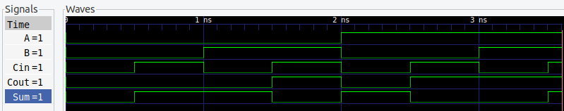
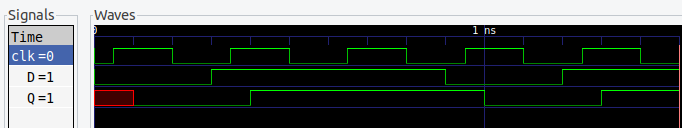

# Digital Logic Simulator

⚠️ **Work in Progress** - Event-driven digital logic simulator in C++.

## Build & Run

```bash
mkdir build && cd build
cmake ..
make
./test_integration
```

## Example: General Circuit Construction

### Create Signals

```cpp
// Syntax: create_signal("Name", Initial_Value)
Signal* in1 = sim.create_signal("Input1", 0);
Signal* in2 = sim.create_signal("Input2", 0);
Signal* out1 = sim.create_signal("Output1", 0);

Signal* clk = sim.create_signal("clk", 0);
Signal* d = sim.create_signal("D", 0);
Signal* q = sim.create_signal("Q", 2);
```
### Create Gates

```cpp
// Syntax: create_gate<GateType>(Propagation_Delay_in_ps)
auto* myGate = sim.create_gate<ANDGate>(100); 
```
### Create DFF
```cpp
// Create DFF with 50ps delay
DFF* dff = new DFF(50);
```

### Connect Components

```cpp
// Connect inputs
myGate->connect_input(in1);
myGate->connect_input(in2);

// Connect output
myGate->connect_output(out1);

// Connect clk, d, q
dff->connect_clock(clk);
dff->connect_data(d);
dff->connect_q(q);
```

## Example (Combinational): Full-Adder Circuit

Note: Full test found in tests/test_comp.cpp

### Waveform Output



Note: Propogation delay of all gates = 0.

View VCD files with [GTKWave](http://gtkwave.sourceforge.net/) or any waveform viewer.

## Example (Sequential): DFF

### Waveform Output



Note: Propogation delay of DFF = 50ps.


## Available Components

- `ANDGate(delay)` - AND logic
- `ORGate(delay)` - OR logic  
- `NOTGate(delay)` - NOT logic
- `XORGate(delay)` - XOR logic
 - `DFF(delay)` - D flip-flop (positive-edge sequential storage)

## Features

✅ Event-driven simulation with configurable gate delays  
✅ Multi-gate circuits (half-adder, full-adder tested)  
✅ VCD waveform output for visualization  
✅ Signal tracing and debug output  

## Status

**Currently implemented:** Events, Signals, Basic Gates, Multi-gate circuits, DFF, and Waveform tracing  
**Coming soon:** More sequential elements, Netlist parser, Memory optimization